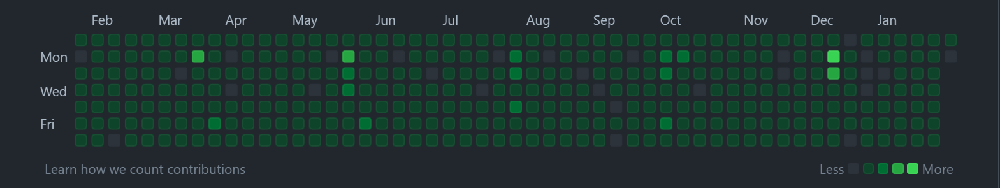
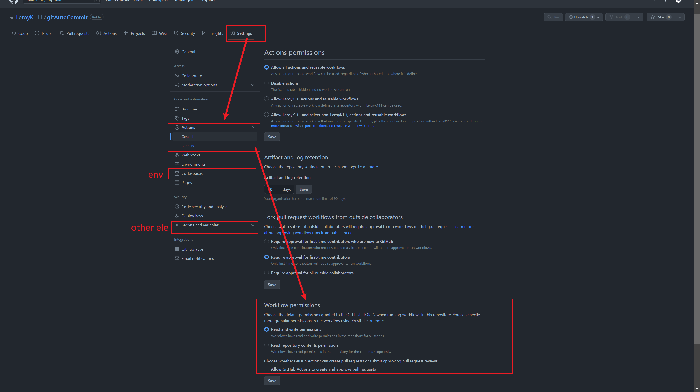
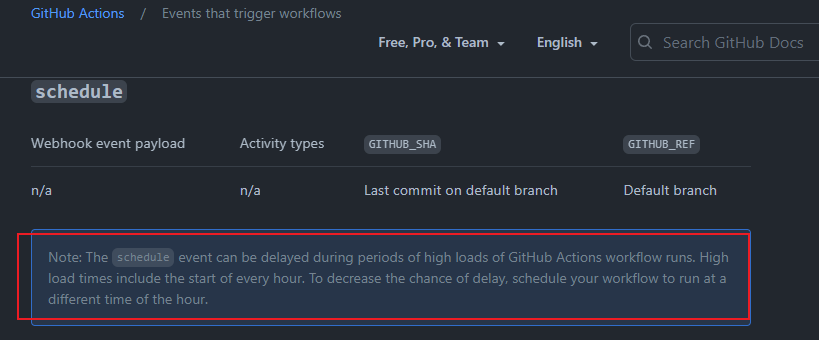

# usageMode
Keep your warehouse committed every day!



Just for fun, of course.
Code is still down to earth learning.

```
$ git clone git@github.com:LeroyK111/gitAutoCommit.git
```

Create your own new warehouse.

And then push.

*★,°*:.☆(￣▽￣)/$:*.°★*.

You're done!

## Key points:



## prolems that may occur
Don't worry if the timing function fails, it happens all the time.

https://docs.github.com/en/actions/using-workflows/events-that-trigger-workflows#schedule

